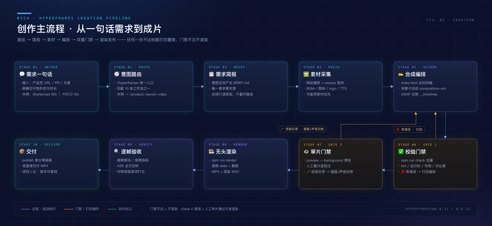
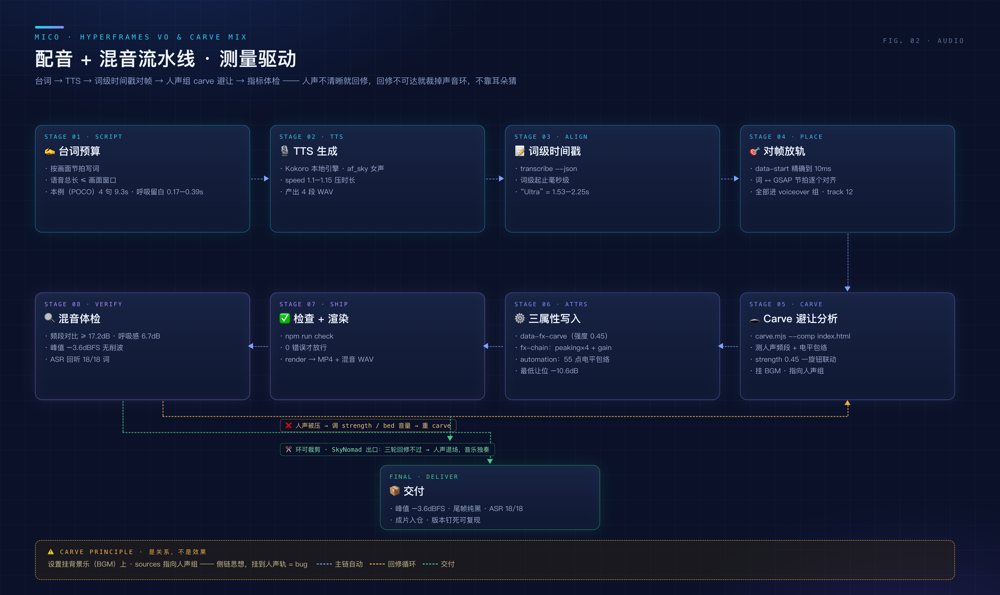

# 🎬 HyperFrames ：从一句话需求到成片

<callout emoji="pushpin" background-color="light-blue" border-color="blue">
**需求原文各只有一行，交付却是两支完整成片 —— 全程未使用任何剪辑软件。**

**① 小米澎程 SkyNomad N90**："帮我给 https://www.xiaomiev.com/skynomad/n90 也创作一个高端的宣传视频，主题是 SkyNomad。" —— 交付 **30.5s · 中文七幕 ·「一车一世界」**，纯音乐混音 −15.1 LUFS（综合响度）。

**② POCO F9 Ultra**："为线上产品 https://www.mi.com/global/product/poco-f9-ultra/ 创建一个 10 秒的产品介绍视频，包含淡入标题、背景视频和舒缓的背景音乐。" —— 交付 **10.7s · 英文三幕**，18 词配音 ASR（自动语音识别）回听全对。

两支片子走同一条六步主链：**读产品页 → 分镜定节拍 → 画面 → 配音对帧 → 混音 → 机器验收**；源文件全 HTML/CSS，任何人可复现、可验证。
</callout>

*成片 v2 · SkyNomad N90 30s 叙事片 ｜ 成片 v13 · POCO F9 Ultra 10s 介绍片 ｜ 09-14 迭代：F2 双机位卡片升级为官方页实拍视频*

官方资料已足够完备：GitHub 仓库提供完整文档，30 天官方教程从入门到进阶（链接统一见文末参考资源）。本文不复述，只聚焦两点：**两支片子的完整制作过程**，与**实践之后对这个工具的评估**。

---

## 🧭 一、动机：当 HTML 不再只是网页

HyperFrames 改写了 HTML 的角色：DOM 是时间轴，CSS / GSAP 是运镜与动效，浏览器是渲染引擎，一条命令将页面逐帧捕获为 MP4 —— 对前端工程师，这是一次技能的意外迁移：最熟悉的工具，出现在了最意想不到的位置。

与既有方案对比：

| 方案 | 制作一支短片 |
|-|-|
| 🎬 剪辑软件 | 心中已有精确清单，仍要在时间轴上逐一手动摆放，改一版重摆一版 |
| ⚛️ Remotion | 视频进入代码，但先要搭一个完整 React 工程（组件 / 状态 / 构建链） |
| 🌐 HyperFrames | **一个 HTML 文件就是一部片子** —— 零工程、零时间线 |

为验证这句承诺，我选择完整制作两支真实的产品片，而非停留在示例层面。

---

## 🛠️ 二、实践过程

HyperFrames 的制作是一条主链：**读产品页 → 分镜定节拍 → 画面 → 配音对帧 → 混音 → 机器验收**。实例取自顶部的两支成片 —— POCO F9 Ultra 与 SkyNomad N90，后者需求里的那个「也」字就来自前者的交付。

### 📖 1. 读素材与分镜：节拍先于像素

第一步不是写 HTML，而是通读产品页 —— 先回答「这支片子必须出现什么」，再排节拍。POCO 据此定为三幕：

| 幕 | 时间轴 | 内容 | 关键节拍 |
|-|-|-|-|
| **F1 氛围** | 0 – 4.72s | 品牌印章 → 标题堆叠 → 卖点走马灯 | ULTRA 字塔 1.54–2.24s |
| **F2 揭名** | 4.22 – 8.11s | kicker → 主图 → 200MP 数字滚动 → 双机位卡片 | 数字滚完 5.62s ｜ 卡片硬切 6.02s |
| **F3 定版** | 7.61 – 10.74s | 品牌锁定 → slogan 缎带 → 胶片淡出 | 缎带 9.46s ｜ 黑场 10.46s |

💡 三幕之间不做硬切，保留 **0.5s 交叉重叠**（F1 尚未出场，F2 已开始入场）自然过渡 —— 这在时间线工具里需要大量关键帧，在这里只是相邻两行的 `data-start` 数值。

SkyNomad 以一个提问开场 ——「一辆车，能装下多少种生活？」—— 并以七幕问答弧作答：**问 → 命名（型方面润）→ 空间（不止一种答案）→ 证据（1831L）→ 并置（商务 / 家庭双世界）→ 远方（1705km）→ 定版（一车一世界，自在即澎程）**。全片在两个质感界面上交替、交替即呼吸，末帧以原始亮场车图做全片唯一一次反转收束：

| 界面 | 出场 | 质感 |
|-|-|-|
| 📜 **纸界** | F2–F5 | 纸白编辑版面：单一墨色、1px 发丝线、0 圆角 0 阴影 |
| 🎬 **影界** | F1 / F6 | 品牌原生暗色电影面：摄影全幅 |
| 📷 **原图** | F7 | 原始亮场车图直出：全片唯一一次反转 |

其中 1831 与 1705 两个数字帧，复用的正是 POCO 片中验证过的计数 + 填充轨道语言。

### 🖼️ 2. 画面：预览即渲染

画面层没有引入任何新语言，语义却变了：

| 日常写页面 | 写片子 |
|-|-|
| 元素 + `data-start` / `data-duration` | 一个时间片段 |
| `` 引一张图 | `data-composition-src` 引一个子合成场景 |
| GSAP 交互动效 | GSAP 时间线动画 |

<callout emoji="bulb" background-color="light-yellow" border-color="yellow">
🎯 **为什么"预览即渲染"如此重要？** 视频是逐帧捕获的：渲染第 323 帧时，页面必须与预览时的第 323 帧完全一致。HyperFrames 中预览与渲染共用同一套 Web Audio / 动画运行时 —— 不是"很接近"，而是**同一条代码路径**。代价是一条铁律：动画中禁用 `Date.now()` / `Math.random()` / 网络请求。
</callout>

一个反直觉的事实：**换一个声音，动的是整条时间线** —— SkyNomad v3 换音色后语速快约 20%，七幕的全部动画 cue、帧长与总时长随之重排（37.0s → 30.5s），而这在源文件里只是一轮可 diff 的修改。

🥊 **画面层最硬的一仗**，是 SkyNomad 交付前那句「商务和家庭两个用处的时候，图片会突然拉伸一下」。出问题的是 F5 双世界面板的 book-open 旋转入场（`rotateY(48°→12°)` + `perspective: 1600px`）：预览里是标准三维透视，成片里却观感为"照片横向压扁再展开"。定位靠新旧两版渲染的**同一帧逐像素对比**：

| 同帧对比（19.35s） | 实测 | 推论 |
|-|-|-|
| 面板**右缘** | 缩进 **56px**（x=1759，设计位 1815） | 横向被压扁 |
| 面板**上下缘** | 完全笔直，与修复版一致 | 排除透视形变（那会留下梯形斜边） |

结论：渲染管线把 CSS 3D 透视**压平成了仿射横向挤压**（48° 可见宽度 ≈ cos 48° ≈ 67%）。修复不是调角度，而是换语言：

| 对比 | 原设计（3D 旋转） | 修复（纯 2D） |
|-|-|-|
| 入场 | `rotateY(48°→12°)` + `perspective: 1600px` | x ±44px + **等比** scale 0.85→1 + opacity |
| 照片比例 | 被横向挤压破坏 | 等比缩放，比例不动 |

验证：修复后同一时刻面板实测长宽比与设计值 **1.2195 精确一致**，上下缘逐列抖动 0px；修复版渲染到新文件 `video-v2.mp4`，旧片 md5 校验分毫未动。

<callout emoji="zap" background-color="pale-gray" border-color="gray">
🔑 一句纯观感反馈，最终落实为三个可复查的数字（**56px** 挤压量 / **1.2195** 修复后长宽比 / **md5 不变**）—— 这就是"视频有了回归测试"的意思。
</callout>

### 🔊 3. 声音：对帧、避让与一次退场

POCO 的配音走「词级对帧」：本地 Kokoro TTS 合成 4 句英文女声（af_sky），用 `transcribe` 获取**每个词的毫秒级起止时间**，再对照画面源码中的 GSAP 节拍排布：

| 台词 | 与画面的同步点 |
|-|-|
| "POCO F9 Ultra." | "Ultra" 1.53–2.25s ↔ ULTRA 字塔入场 1.54–2.24s |
| "Snapdragon 8 Elite Gen 5." | "Snapdragon" 2.64–3.48s ↔ 走马灯行 2.3–3.16s |
| "Imaging unbound. Two hundred megapixels." | "two hundred" 5.96–6.63s ↔ 数字滚完 5.62s + 卡片硬切 6.02s |
| "POCO F9 Ultra. Ultrapower unbound." | "Ultrapower" 9.41–10.00s ↔ 缎带入场 9.46s |

<callout emoji="zap" background-color="pale-gray" border-color="gray">
🔑 "Ultra" 的读音与字塔入场相差 **10ms** —— 这不是"大致对上"，而是将两份机器输出（ASR 词级时间戳 × GSAP 节拍表）对齐到毫秒级。
</callout>

🎛️ 混音是最有代表性的一次迭代。v6 的反馈："背景音有点吵。" 不凭听感反复调音量，而是**先测量**：BGM 整体比人声**响 7.2dB**，人声在所有频段被压制、最严重在 **250–500Hz（+14.8dB）** —— 恰好是这个女声的基频区。修复是两个参数的协同修改：

| 指标 | v6 | v7 | 改法 |
|-|-|-|-|
| 🎚️ BGM 音量 | 0.9 | **0.6** | 整体 −3.5dB |
| 🕳️ voiceover carve 强度 | 0.25 | **0.45** | 避让频段 3 → 4 个，深度接近翻倍 |
| 🎯 语音频段对比度（最小） | 14.4dB | **17.2dB** | ↑ 人声更突出 |
| 🌊 BGM 呼吸感（语句间隙回弹） | 2.3dB | **6.7dB** | ↑ 静默段音乐明显恢复 |
| ⚠️ 峰值 | ✅ 无削波 | **−3.6dBFS** | 保留安全余量 |
| 🗣️ ASR 回听 | 18 词 | **18/18 全对** | 机器可完整识别 |

carve 是内置的人声避让机制 —— 类似侧链压缩，但按频段避让而非整体压低，最终在 BGM 上形成 4 个避让频段 + 55 点电平包络（最低 −10.6dB，跟随人声起落）：

| 频段 | 160Hz | 250Hz | 1600Hz | 2500Hz |
|-|-|-|-|-|
| 挖深 | −7.9dB | −4.6dB | −9.2dB | −4.6dB |

<callout emoji="bulb" background-color="light-blue" border-color="blue">
🧠 **carve 是关系，不是效果**：设置挂在**背景乐**上、指向**人声组**（如同侧链压缩）。它只避让人声实际占用的几个频段，音乐保留低频与高频 —— 人声清晰，音乐完整。v6 的问题一半源于 carve 强度仅为 0.25，避让深度不足。
</callout>

一句"有点吵"，最终落实为两个参数值与一张可复查的测量表。

SkyNomad 的中文人声之路曲折得多，四轮反馈完整记录：

| 版本 | 方案 | 反馈（原文） |
|-|-|-|
| v1 | 本地 Kokoro `zf_xiaobei` 整句直录 | "背景音乐咋没了，不够科技动感，而且人音很奇怪，像是蹩脚中文" |
| v2 | 同音色重录：7 句、短语拆分、1.0 语速 | "背景音乐太吵了，需要舒缓一些的，去掉字幕，语音使用柔和的女音" |
| v3 | 换 `zf_xiaoyi`（轻盈柔美）+ 舒缓 BGM（候选中起音密度最低的一支，2.70 次/s）+ 去字幕 | "人音还是太差了，可以使用官方语音库吗" |
| v4 | 切换 HeyGen 官方语音库 | 服务不可用 |
| **终版** | **砍掉全部人声与音效，音乐独奏**（响度 −15.1 LUFS / 真峰值 −1.7 dBTP）+ 末帧原图直出 | "这一版可以了" |

期间踩了 Kokoro 中文 G2P 的数字坑，**大写金额数字**是唯一可靠绕法：

| 数字 | 坑 | 绕法 |
|-|-|-|
| "1831" | 吞掉个位 | 壹仟捌佰叁拾壹 |
| "1705" | 逐位读成"一七零五" | 壹仟柒佰零伍 |

有意思的是：七幕节拍原本按 VO 词点排布，去掉人声后**画面零改动**，节拍网格依然成立 —— 这一版反而观感最好。

<callout emoji="bulb" background-color="light-yellow" border-color="yellow">
🧠 **减法的理由**：整支片子改为纯音乐叙事，「科技潮流 × 高端舒适」全部交给音乐承担；末帧撤掉全部调色、直接放原始车图是同一个逻辑 —— 观众看到正确的车型，比看到统一的电影感更重要。
</callout>

### 🎯 4. 精修与验收：把观感变成数字

✨ 精修是同构的另一例。POCO v12 的反馈只有一句："需要看着更高端一点。" 同样**先测量**：逐个验证调色槽位后发现，bloom（光晕）是阈值门控的（约 170 luma，8-bit 亮度），这条氛围素材全场最亮 90 —— 强度拉满也一像素不变，结构性死路。修复不是硬调参数，而是**把光晕烘进资产生成器**（亮核离线高斯晕散，按金色 tint 的通道导数加权加回）：

| 维度 | v12 | v13 | 手段 |
|-|-|-|-|
| 💡 光核亮度 | 89.7 | **108.7**（+21%） | 资产烘焙 glow |
| 🌫️ 受光面积占比 | 5.4% | **7.9%**（+46%） | 同上 |
| 🕳️ 画面边缘 | 基准 | **−21%**（光池对比） | vignette 0.32 |
| 🎞️ 颗粒能量 | ×1.0 | **×1.9–3.1**（可见胶片颗粒） | grain 0.65 |

<callout emoji="bulb" background-color="light-blue" border-color="blue">
🧠 **效果槽位失效 ≠ 需求失效**：shader 的 bloom 够不到这条暗场素材的亮度阈值，就把光晕下放到资产层离线烘焙 —— 效果要放在它能真正生效的那一层。
</callout>

验收则全程机器化（POCO v13 终验；测量口径：响度 —— ffmpeg EBU R128，频段与起音 —— 自写频谱分析，帧亮度与几何 —— 渲染帧逐像素统计，语音回听 —— 本地 ASR）：

| 检查项 | 结果 |
|-|-|
| `npm run check`（lint + 运行时 + 布局 + 对比度） | ✅ 0 错误 |
| 逐帧尾部检查（末 3 帧亮度） | ✅ 0.07 → 0.04 → 0.12 视觉纯黑收尾（最亮像素 4/255） |
| 音频峰值 / 削波 | ✅ −3.6dBFS 无削波 |
| ASR 全文回听 | ✅ 18/18 词 |
| 人声 / BGM 频段冲突 | ✅ 人声所有频段领先 ≥17.2dB |

"末三帧亮度 0.07 → 0.04 → 0.12（最亮像素 4/255）"能写进交付清单，前提是每一帧都可精确重放。**视频第一次拥有了"测试"这一概念。**

---

## 🗺️ 三、工作流图解

> 🎨 两张流程图均为单文件 HTML+CSS 绘制，经 Chrome 无头截图输出 4000px 宽 PNG：`chrome --headless=new --force-device-scale-factor=2 --window-size=2000,<高> --screenshot=out.png flow-xxx.html` —— 图与成片一样，都由修改源文件直接产生，这本身也是"文本工程"的一个注脚。

### 1️⃣ 创作主流程

*蛇形主链 + 两道回修环 —— 机器查错打回，观感反馈重修*

### 2️⃣ 配音 + 混音流水线（TTS → 对帧 → carve）

配音并非"生成一个 MP3 放进去"，而是一条**测量驱动**的流水线：

*TTS → 词级对帧 → carve 避让 → 测量验收*

这条主链的每一环都可被裁剪，主链本身不可以 —— SkyNomad 的声音环就是一例：从「人声退场、音乐独奏」的出口离开（见 2.3），画面环与验收环原样跑完。

---

## 💭 四、思考与总结

**1. 📝 视频第一次成为文本工程。** 每支片子是 workspace 下的一个目录：HTML 可 diff、可 review、可版本化。v6 → v7 的混音修改在 git 中只是几行属性值 diff；F5 拉伸修复则是删掉两段 rotateY 补间、去掉一条 perspective —— "背景音有点吵""图片会突然拉伸一下"这类主观反馈，第一次有了精确的对应物。

**2. 🤝 AI 协作的方式改变了。** 本文的成片即是例证：需求各只有一行，全流程（读产品页、分镜、画面、配音、混音、验收）由 Agent 完成，人只承担两个动作 —— **提出需求、给出反馈**。HyperFrames 的 skill 体系将"做视频"拆解为 Agent 可执行的操作手册，而非要求人学一个新软件。

**3. ♻️ 流程可复制，启动成本趋近于零。** 换产品（手机 → SUV）、换语言（英文 → 中文）、时长放大三倍，主链原样可跑；验收清单与数字帧语言被直接引用 —— 方法论不需要为新产品重学任何东西。

**4. ✂️ 做减法也是交付。** SkyNomad 的旁白在"官方语音库不可用"处走到尽头，纯音乐版反而观感最好；末帧原图直出同理。约束出现时，"砍掉哪个维度"与"做好剩下的维度"是同级工程决策 —— 交付的不是实现了所有需求的片子，而是约束之下最好的片子。

**5. 📐 验收可以精确到帧与 dB。** 末三帧亮度、频段对比度、ASR 全对 —— 不是修辞，而是可复现的测量。这正是确定性的价值：同样的话无法对一条时间线说。

**6. ⚠️ 它并非万能，需要正视的局限：**

| 局限 | 要点 | 对策 |
|-|-|-|
| 📈 学习曲线 | "会写网页就会写视频"在动效层基本成立；混音判断（基频区、carve 深度取舍）无法由工具替代 | 音频层先补课再上手 |
| 🇨🇳 中文本地 TTS | 英文 18 词回听全对；中文三轮迭代不过关，最终音乐独奏；数字 G2P 有坑 | 一开始就评估纯音乐 / 官方语音库路线 |
| 🧊 CSS 3D 不保形 | rotateY 入场被压平为仿射横向挤压（实测缩进 56px） | 照片类素材用平面 2D（等比 scale + 位移） |
| 🔒 生态早期 | 两项目分别锁 `hyperframes@0.8.31` / `0.8.33` —— 可精确复现，但 API 可能变动 | 锁定版本 |
| 🛠️ 实践杂项 | TTS 需 kokoro-onnx venv（`HYPERFRAMES_PYTHON` 指向它）；数字开头 id 选择器写 `[id="…"]`；变速仅支持恒定 `data-playback-rate` | 中途变速离线预处理 |
| 🎯 适用边界 | 数据 / 产品 / 动效驱动的 10s–90s 短片优势明显 | 实拍精细剪辑的长片仍交给剪辑软件 |

---

## 📚 五、参考资源

| 资源 | 链接 |
|-|-|
| 📦 GitHub 仓库 + 官方文档 | [https://github.com/heygen-com/hyperframes](https://github.com/heygen-com/hyperframes) |
| 📆 30 天官方教程 | [https://hyperframes.heygen.com/thirty-days](https://hyperframes.heygen.com/thirty-days) |
| 🧪 本文实践源码（SkyNomad N90 × POCO F9 Ultra） | [https://git.n.xiaomi.com/open-source-repositories/hyper-frames-practice](https://git.n.xiaomi.com/open-source-repositories/hyper-frames-practice) |

建议的实践路径：`npx hyperframes init` 起一个新项目，先完成官方 30 天教程，随后**不要停留在示例项目** —— 直接选择一个自己的产品 / 文章 / PR，完整复刻这套流程：**读产品页 → 分镜定节拍 → 画面 → 配音对帧 → 混音 → 机器验收**。

> 下一次收到"帮我把这个做成视频"的需求时，不妨试着回答：可以，给我一个 HTML 的时间。🎥
